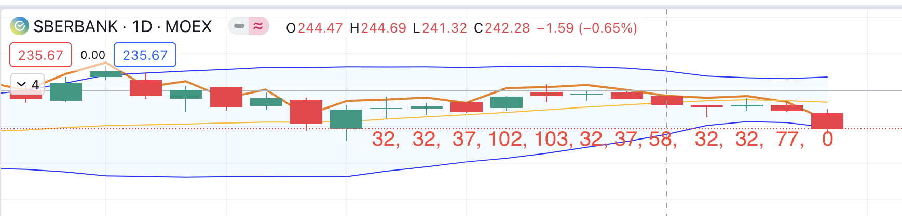

# Machine Learning with MOEX (LSTM/Classifier)

Sorry, legacy!\
Because research project

# Classifier model:
1) roll **close** for **y** data as **tomorrow_close** converts to >>> **0** - price go down; **1** - price risen (*output data*)
2) [**open** **high** **low** **close**] converts to >>> **candles patterns** (with library [TA-lib](https://github.com/TA-Lib/ta-lib-python#pattern-recognition)) (*input data*)
   

Results model:\
Input data: **143_128** (validation_split=**0.2**)\
Input X: **12 candles**\
Input Y: **1 value** (**0** - price go down; **1** - price risen)\
Predict direction on itself: **66.18%** (94721 / 143_128)\
Output: **2 values** from 0 to 1 - predictions price **go down**/**price risen** ([0.4, 0.6])

Model file: [model](models/moex_vClassification.h5)\
Scaler file: [scaler](models/scaler_0_1.pkl)

# TODO ideas to research:
1) Decide on Y + EFI (calc and return EFI with X)
2) visualize: draw candles with number of patterns [mplfinance](https://github.com/matplotlib/mplfinance)
